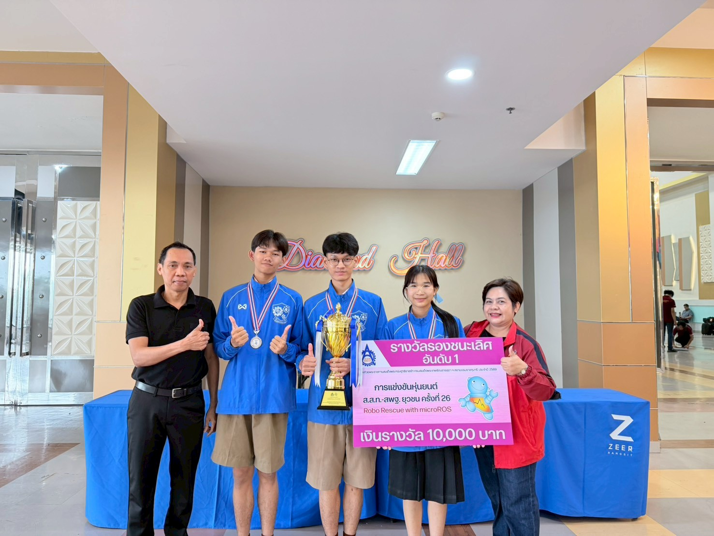
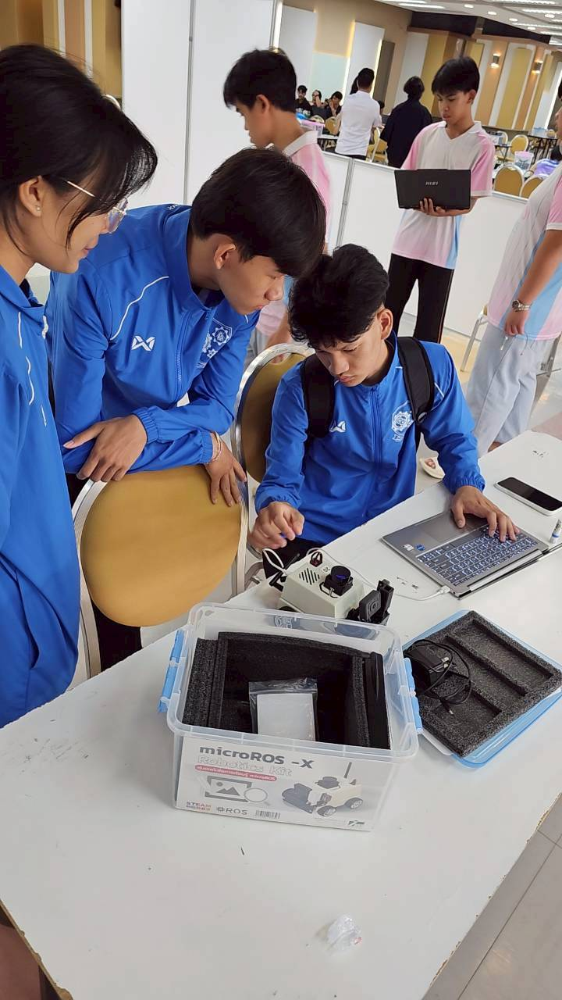

# 🤖 Autonomous Search-and-Rescue Robot — RRR26

**ROS 2 · Nav2 · Computer Vision (AprilTag) · micro-ROS** | หุ่นยนต์กู้ภัยอัตโนมัติ

> Autonomous 4-wheel rescue robot that maps an unknown arena, self-navigates to survivors, identifies them by tag, and dispenses aid — **end-to-end with no human control during the run.**
>
> หุ่นยนต์กู้ภัยอัตโนมัติ 4 ล้อ ที่สร้างแผนที่สนามเอง วิ่งหาผู้ประสบภัยเอง ระบุตัวด้วย AprilTag และปล่อยกล่องชิงชีพ — **ทำงานเองทั้งหมด ไม่มีการบังคับระหว่างรอบแข่ง**

## 🥈 1st Runner-up — National Championship / รองชนะเลิศอันดับ 1 ระดับประเทศ

**Robo Rescue with micro-ROS** — TPA Robot Thailand Championship 2026 (ส.ส.ท.–สพฐ. ยุวชน ครั้งที่ 26), competing for **HRH Princess Maha Chakri Sirindhorn's Royal Trophy** · 30–31 May 2026, Bangkok.

🥈 รางวัล **รองชนะเลิศอันดับ 1** การแข่งขันหุ่นยนต์ ส.ส.ท. ชิงแชมป์ประเทศไทย ประจำปี 2569 ชิงถ้วยพระราชทานสมเด็จพระกนิษฐาธิราชเจ้า กรมสมเด็จพระเทพรัตนราชสุดาฯ สยามบรมราชกุมารี

> **Team PSPray** · Prajaksilapakarn School / ทีม PSPray · โรงเรียนประจักษ์ศิลปาคาร
> Passed every round · **100%** vision-recognition accuracy · zero navigation failures · clean servo dispensing.

<p align="center">
  
  <br><i>🎥 Race-day autonomous run — the robot self-navigates to a walled survivor pocket (no human control)<br>หุ่นวิ่งอัตโนมัติวันแข่งจริง — เข้าหา survivor pocket เอง ไม่มีการบังคับ</i>
</p>

<p align="center">
  
  <br><i>Team PSPray with the 1st Runner-up trophy — Robo Rescue with micro-ROS, Diamond Hall<br>ทีม PSPray รับถ้วยรองชนะเลิศอันดับ 1 — Robo Rescue with micro-ROS</i>
</p>

> 🌏 **Qualified to represent at RoboCup Junior 2026** (international championship, Incheon, South Korea · 30 Jun – 6 Jul 2026) — this placement earned our team a spot at the international stage.
>
> 🌏 **ได้สิทธิ์เป็นตัวแทนไปแข่งระดับนานาชาติ RoboCup Junior 2026** (เมืองอินชอน เกาหลีใต้ · 30 มิ.ย. – 6 ก.ค. 2026) — ผลรองชนะเลิศอันดับ 1 ทำให้ทีมได้สิทธิ์ก้าวสู่เวทีระดับโลก

---

## 👤 My Role / บทบาท

**Sole software developer** — I designed and wrote the entire autonomy stack myself: SLAM mapping, Nav2 navigation tuning, the computer-vision node, the mission state machine, the servo dispenser logic, and all bring-up/diagnostic tooling.

ผมเป็น **ผู้พัฒนาซอฟต์แวร์เพียงคนเดียวของทีม** — ออกแบบและเขียนระบบอัตโนมัติทั้งหมดด้วยตัวเอง ตั้งแต่ระบบสร้างแผนที่ (SLAM), การจูน Nav2, โหนด computer vision, state machine ของภารกิจ, ตรรกะ servo ปล่อยกล่อง ไปจนถึงเครื่องมือ bring-up/diagnostic ทุกตัว

<p align="center">
  
  <br><i>Final tuning at the pit — microROS-X robot + live debugging on race day<br>จูนระบบหน้างานที่พิต — ดีบักโค้ดสดวันแข่ง</i>
</p>

---

## 🧠 Technical Highlights / จุดเด่นเชิงเทคนิค

| Area | What I built |
|---|---|
| **Autonomous Navigation** | Nav2 stack on a custom SLAM map (slam_toolbox), AMCL localization, DWB controller, tuned costmaps + recovery behaviors for tight U-shaped "survivor pockets" |
| **Computer Vision** | Real-time AprilTag (tag36h11) detection node on an ESP32 camera stream, with a vote-based warm-up gate that confirmed survivor IDs in **2.5 s, 100% of the time** |
| **Distributed Systems** | Robot runs **micro-ROS (DDS-XRCE) over Wi-Fi UDP**, bridged into the ROS 2 graph via a Dockerized agent — the robot itself never runs ROS 2 |
| **Mission Control** | Interactive waypoint mission engine with software watchdog, timeout-based recovery, and a 2-strike servo dispenser for delivering aid boxes |
| **Engineering Rigor** | Log-driven verification, fallback strategies for every failure mode, per-Wi-Fi reconfiguration tooling, full post-mortem documentation |

---

## 📊 Verified Results / ผลที่ตรวจสอบจริง

Pulled from the actual race-day ROS logs / ดึงจาก log จริงวันแข่ง:

- **Vision:** AprilTag IDs 115, 112 detected with a **perfect vote** every time (e.g. 17/17 frames). The spin-to-search fallback I built was **never even needed**.
- **Servo dispenser:** Aid boxes released cleanly at every survivor point, **2.8–5.7 s** per drop, zero misfires.
- **Navigation:** **No FAILED states, errors, or recovery loops** across the mission logs. Collision-aware back-up recovery triggered as designed at every approach and the robot continued every time.

> ระบบวิชัน (computer vision) อ่าน tag แม่น 100% ทุกครั้ง · servo ปล่อยสะอาดทุกจุด · นำทางไม่มี fail แม้แต่ครั้งเดียว

---

## 🏟️ System Overview / ภาพรวมระบบ

A 3-phase pipeline, each phase a self-contained module I built and can run independently:

| Phase | Module | What it does |
|---|---|---|
| **1. Bring-up** | `start_up_robot/` | Configure robot over USB-serial, launch micro-ROS agents, teleop + watchdog |
| **2. SLAM** | `slam_map/` | `slam_toolbox` online mapping → save occupancy grid |
| **3. Navigation** | `navigator_map/` | Nav2 + waypoint mission + vision + servo drop (the race-day runtime) |

<p align="center">
  
  
</p>
<p align="center"><i>Left: arena mapped autonomously via SLAM · Right: mission waypoints planned on that map<br>ซ้าย: แผนที่สนามที่หุ่นสร้างเองด้วย SLAM · ขวา: waypoint ภารกิจที่วางบนแผนที่</i></p>

### ⭐ Highlight — custom waypoint editor (praised by the judges) / เครื่องมือทำ waypoint ที่กรรมการชม

Most teams record waypoints by physically driving the robot to each spot and capturing its pose. I built a faster way — [`pick_waypoints.py`](navigator_map/pick_waypoints.py): **click straight on the SLAM map and get the world coordinate instantly.** It converts the clicked pixel to a real-world `(x, y)` using the map's `resolution` + `origin`; a second click sets the robot's heading (yaw → quaternion). **Right-click drops `via` points** to shape the path through the tight U-shaped survivor pockets, and every point can be dragged (or Shift-dragged to re-aim). It loads an existing `nav_waypoints.yaml` so you can keep editing. **The competition judges singled out this click-to-coordinate + via-point tool as a standout.**

ทีมส่วนใหญ่เก็บ waypoint ด้วยการขับหุ่นไปทีละจุดแล้ว capture pose จริง — แต่ผมทำให้เร็วกว่าด้วย [`pick_waypoints.py`](navigator_map/pick_waypoints.py): **คลิกบนแผนที่ SLAM แล้วได้พิกัดโลกทันที** (แปลง pixel → `(x, y)` จาก `resolution` + `origin` ของแผนที่, คลิกที่ 2 กำหนดทิศหุ่น → quaternion), **คลิกขวาเพื่อวาง `via` point** จัดเส้นทางเข้ามุมแคบของ survivor pocket ได้, ลาก/Shift-ลากแก้จุดได้ และโหลดไฟล์เดิมมาแก้ต่อได้ — **กรรมการชมเครื่องมือ "คลิกได้พิกัด + ทำ via" ตัวนี้เป็นพิเศษ**

### Architecture / สถาปัตยกรรม

```
┌──────────────┐   Wi-Fi UDP    ┌─────────────────────┐      ┌──────────────┐
│  Yahboom     │  (micro-ROS /  │  micro-ROS Agent     │ ROS2 │  Nav2 +      │
│  robot base  │───DDS-XRCE────▶│  (Docker, host PC)   │─────▶│  Vision +    │
│  + ESP32 cam │                │  bridges to ROS 2    │      │  Mission FSM │
└──────────────┘                └─────────────────────┘      └──────────────┘
```

---

## 🛠️ Tech Stack

`ROS 2 Humble` · `Nav2` · `slam_toolbox` · `AMCL` · `AprilTag (tag36h11)` · `micro-ROS / DDS-XRCE` · `Docker` · `Python` · `OpenCV` · ESP32 camera · MG90S servo

---

## 🚀 Run it / วิธีรัน

```bash
# Phase 1 — bring-up
cd start_up_robot
./start_agent_computer.sh      # micro-ROS agent for robot base (port 8090)
./start_Camera_computer.sh     # micro-ROS agent for ESP32 cam (port 9999)
python3 config_robot_<wifi>.py # one-time: set SSID / agent IP / domain id over USB

# Phase 2 — SLAM mapping
cd ../slam_map
./slam_map.sh                  # slam_toolbox + RViz, drive to build the map
./save_map.sh && cp my_robot_map.* ../navigator_map/

# Phase 3 — navigation
cd ../navigator_map

#  (3a) define the mission waypoints  →  writes nav_waypoints.yaml
python3 pick_waypoints.py      # click target points on the map (Tkinter)
#   or drive the robot and capture live TF poses:  python3 get_waypoint.py
python3 gen_via.py             # optional: insert "via" points for tight turns
python3 draw_waypoints.py      # preview the waypoints overlaid on the map

#  (3b) run the autonomous mission
./run_all_mission.sh           # Nav2 + vision node + mission controller
```

> This is **not** a ROS package — each phase is run directly from its own directory (launch files resolve paths against the working directory).

---

## 💻 Key source files / โค้ดที่เขียนเอง

The core of the autonomy stack — all written by me. Click to read:

| File | What it does | LOC |
|---|---|---|
| [`navigator_map/navigator_script.py`](navigator_map/navigator_script.py) | Mission controller — drives the waypoint sequence, software watchdog, timeout/cancel-retry recovery, emergency stop | 403 |
| [`navigator_map/mission_script.py`](navigator_map/mission_script.py) | Per-waypoint logic — vote-based AprilTag confirmation + 2-strike servo dispenser gating | 226 |
| [`navigator_map/Cam_Pose_AprilTag.py`](navigator_map/Cam_Pose_AprilTag.py) | Vision node — AprilTag (tag36h11) detection on the ESP32 stream, gated by `/vision/detect_enable` | 88 |
| [`navigator_map/pick_waypoints.py`](navigator_map/pick_waypoints.py) | ⭐ **Judges' favorite** — Tkinter tool: click waypoints + via points on the map → `nav_waypoints.yaml` (see ⭐ highlight in System Overview) | 547 |
| [`navigator_map/nav2_launch.py`](navigator_map/nav2_launch.py) | Nav2 bring-up — costmaps, AMCL, DWB controller, static TF | 81 |
| [`start_up_robot/watchdog.py`](start_up_robot/watchdog.py) | Real-time camera / IMU / battery health monitor during bring-up | 119 |

โค้ดหลักของระบบอัตโนมัติ — เขียนเองทั้งหมด คลิกเข้าไปอ่านได้เลย

---

## 📚 Documentation / เอกสาร

I documented the full system for reproducibility and handoff — a habit I consider part of good engineering:

- [`navigator_map/CLAUDE.md`](navigator_map/CLAUDE.md) — Nav2 runtime architecture (source of truth)
- [`navigator_map/docs/KNOWLEDGE.md`](navigator_map/docs/KNOWLEDGE.md) — deep-dive tutorial of the whole pipeline
- [`navigator_map/docs/RACE_LESSONS_RRR26.md`](navigator_map/docs/RACE_LESSONS_RRR26.md) — race-day post-mortem
- [`คู่มือวันแข่ง_RRR26.md`](คู่มือวันแข่ง_RRR26.md) · [`yahboom_microros_robot_manual.md`](yahboom_microros_robot_manual.md) — operator manuals

---

## 💡 What I learned / สิ่งที่ได้เรียนรู้

Building a robot that has to work **once, autonomously, in front of judges** taught me that reliability beats cleverness. The hard parts weren't the algorithms — they were systematic field testing, designing a fallback for every failure mode, debugging localization drift under low battery, and keeping the codebase clean enough to change safely the night before a competition.

การสร้างหุ่นที่ต้องทำงาน **ครั้งเดียว แบบอัตโนมัติ ต่อหน้ากรรมการ** สอนผมว่า "ความน่าเชื่อถือ" สำคัญกว่า "ความฉลาด" — ส่วนที่ยากไม่ใช่อัลกอริทึม แต่คือการทดสอบในสนามจริงอย่างเป็นระบบ การออกแบบแผนสำรองสำหรับทุกจุดที่อาจพัง การดีบัก localization ตอนแบตต่ำ และการรักษาโค้ดให้สะอาดพอจะแก้ได้อย่างปลอดภัยในคืนก่อนแข่ง
